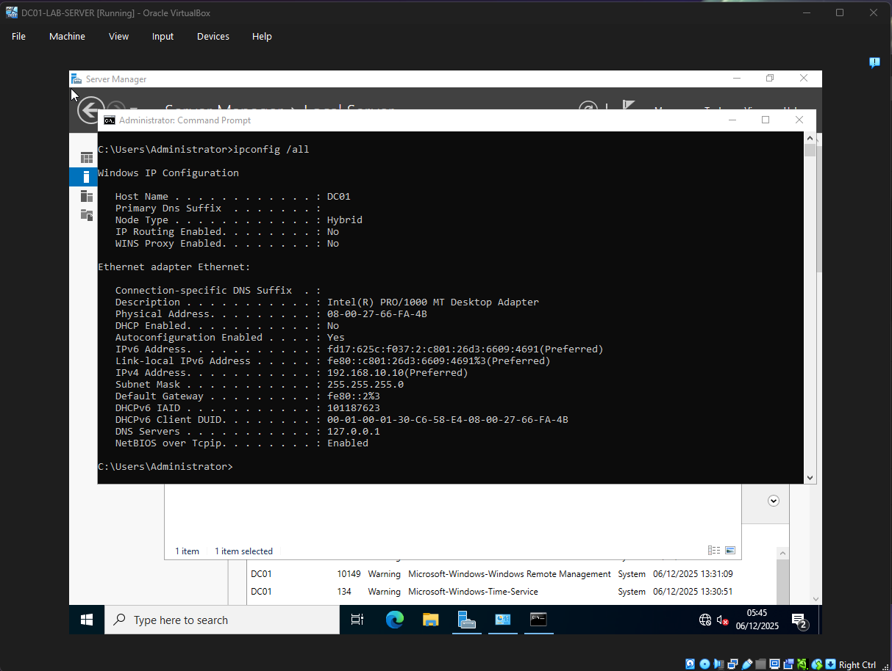
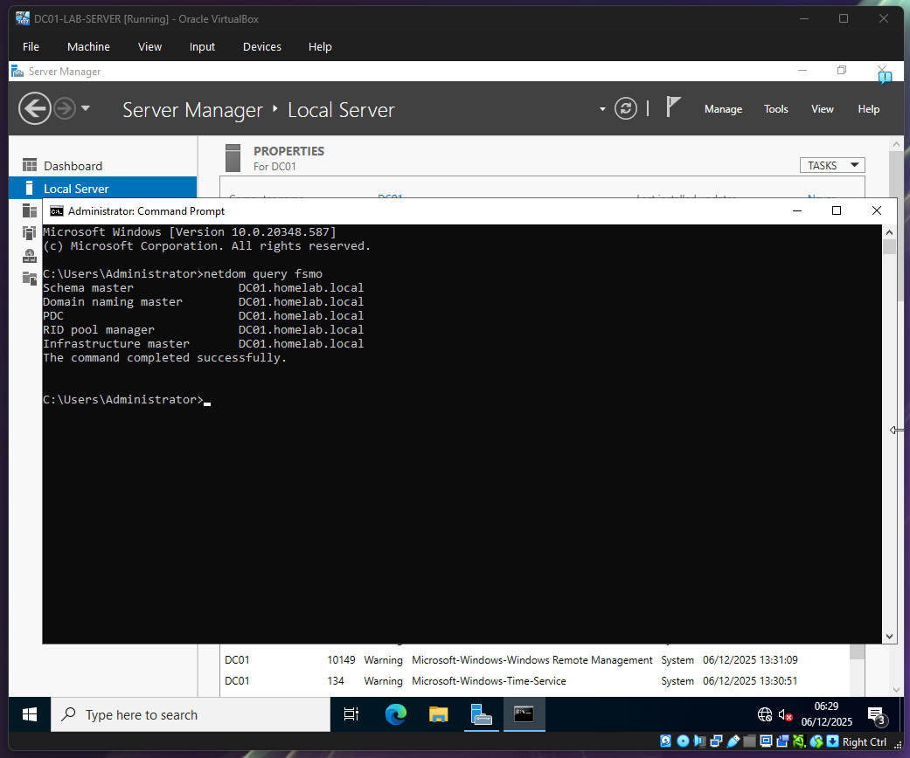
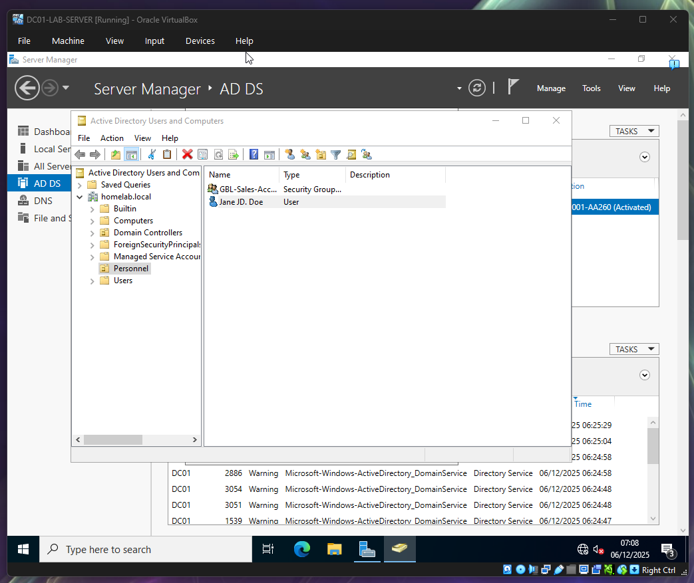
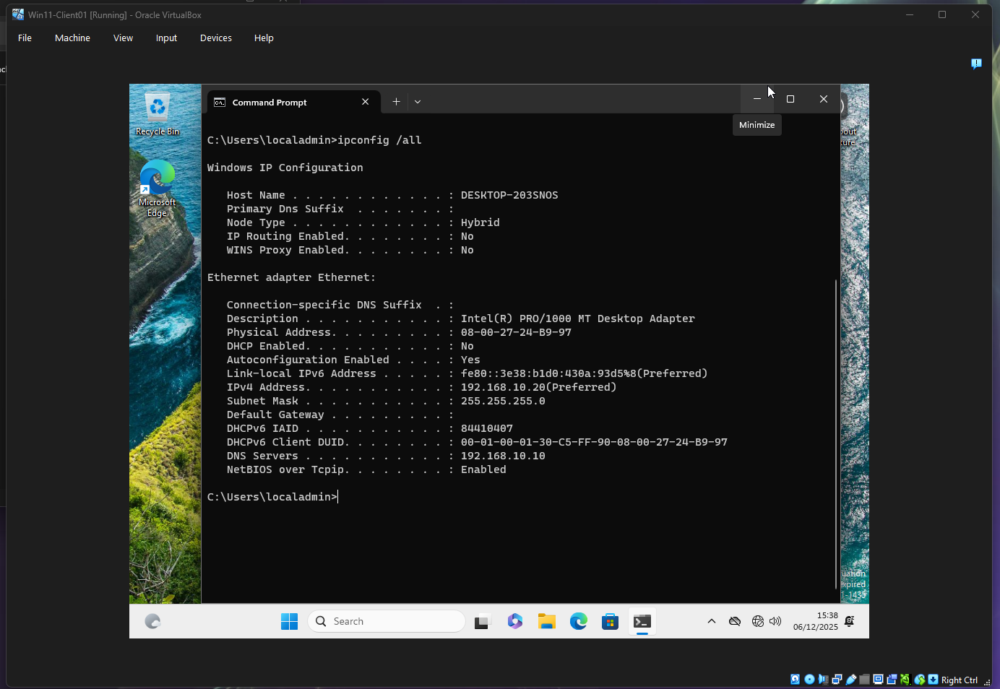
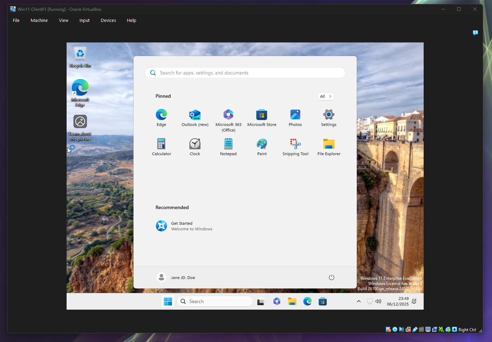

# 📚 Project 1: Building an Active Directory Domain (Homelab Basics)

My goal for this first project was to set up a functional, basic network environment using the tools a small IT department would use. The main challenges I focused on were reliable networking and centralizing user logins. This documentation is written to help me remember exactly *how* I solved each problem.

## 🌟 Key Takeaways (What I Learned)

* **DNS is the Directory:** I learned that Active Directory (AD) won't work unless the server's DNS is pointing to itself (127.0.0.1) and the client is pointing directly to the server (192.168.10.10). DNS is basically the phone book that lets the client find the domain.
* **Small Mistakes are Big Problems:** The entire project stalled because of two tiny typos in the IP address. This taught me that troubleshooting is often just obsessively double-checking simple network settings.
* **Groups Save Time:** Managing permissions is much easier using **Security Groups**. I only have to manage one group, not every single user, which is a massive time saver as the network grows.

***

## 1. Setting Up the DC01 Server

### 1.1 Hardware and Static IP

To make sure the server never crashed or got lost on the network, I took two steps:

* **Hardware:** I gave the server **4 GB of RAM and 2 CPUs**—enough power to run Windows Server 2022 without issues.

* **Static IP (The Logic):** I manually set the IP address to **192.168.10.10**. I learned that servers providing central services **must** have a fixed address.
    * **192.168.10.10** is our chosen, permanent address. I reserved the `.10` for the server because it's the most important device.
    * **DNS:** I set the DNS to **127.0.0.1 (Loopback)**. This is a crucial rule for a Domain Controller: **The DC must use itself for DNS** because it is the only device that holds the address book for the `homelab.local` domain.

***

## 2. Turning the Server into a Domain Controller (AD)

### 2.1 Promoting the Server

I needed the server to become the main boss of the network, so I promoted it to a Domain Controller (DC) for the **`homelab.local`** domain.

* **Action:** I installed the **Active Directory Domain Services (AD DS) Role**.
* **Proof:** I used the command `netdom query fsmo` to make sure the server was correctly holding all the master roles. If this command works, the promotion was successful.

### 2.2 Organizing Users and Permissions

To keep the network clean, I created an organized structure:

* **Organization:** I created the **Personnel OU** (Organizational Unit) to keep department-specific accounts separate from default accounts.
* **User & Group:** I created the test user **Jane Doe (`jdoe`)** and added her to the **`GBL-Sales-Access`** security group. This means that if I ever need to give sales access to a new server, I only give the permission to the group, and Jane automatically gets it.

***

## 3. Connecting the Windows 11 Client

### 3.1 🧠 Troubleshooting the Connection

Connecting the client machine (`Win11-Client01`) to the DC was the hardest part. The connection failed, and I had to figure out why.

* **The Problem:** The ping test from the client to the server (`ping 192.168.10.10`) failed with 100% loss.
* **My Discovery:** I found **two typos** in the client's network settings. The IP was set to `198.168.10.20` instead of `192.168.10.20`, and the DNS was also wrong.
* **The Fix:** I fixed the typos and set the client's DNS to point directly to the server's IP (`192.168.10.10`). This proved that troubleshooting is about patiently checking every small detail.

### 3.2 Domain Join and Final Test

With the network fixed, the domain join was the final proof of concept:

* **Action:** I joined the Windows 11 client to **`homelab.local`**.
* **Verification:** I logged in as **`jdoe`**. The system immediately forced a password change, which confirmed that the DC was successfully controlling the client's security policies. This means the whole setup works!

