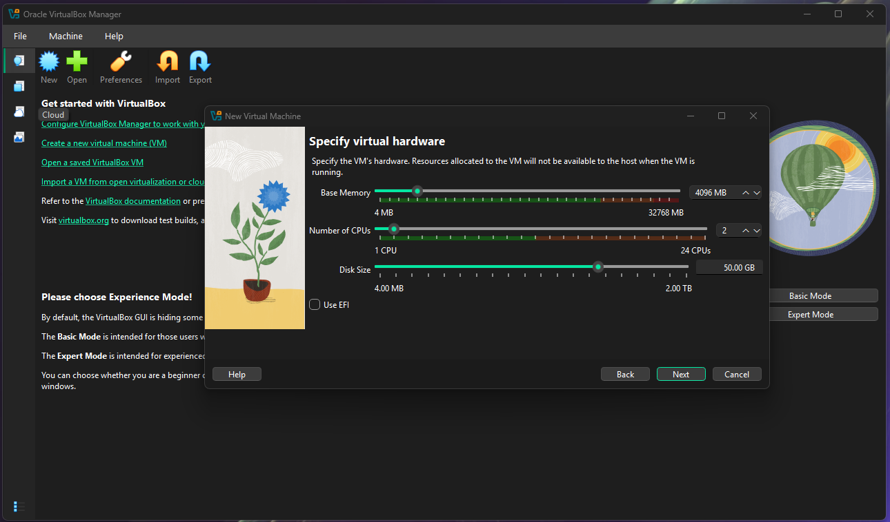

# 🛡️ Active Directory Domain Controller (DC01) Project

## Project Goal
To design, build, and configure a foundational Active Directory (AD) environment from scratch. This project demonstrates core skills in **Virtualization, Static Networking, DNS management,** and **Active Directory User/Group Administration**, which are essential for Help Desk and Junior System Administrator roles.

---

## 1. Initial Server and Network Configuration

* **Server Role:** Windows Server 2022 Standard (Desktop Experience)
* **Server Name:** DC01
* **Domain Name:** homelab.local
* **Primary IP:** 192.168.10.10

### 1.1 Virtual Machine Setup
* **Action:** Allocated dedicated resources for reliable performance.
* **Demonstrated Skill:** Resource management and understanding OS minimum requirements.

### 1.2 Static IP Configuration
* **Action:** Manually configured the server with a static IP and set the Preferred DNS to the loopback address (127.0.0.1) to prepare for Domain Promotion.
* **Demonstrated Skill:** Foundational TCP/IP and DNS configuration.

---

## 2. Active Directory Deployment

### 2.1 Role Installation and Promotion
* **Action:** Installed the Active Directory Domain Services (AD DS) role and promoted the server to a new forest (`homelab.local`).
* **Verification:** Confirmed the successful promotion by querying the FSMO roles.
* **Demonstrated Skill:** Domain creation and verification of critical AD services.

### 2.2 User and Group Management (Help Desk Simulation)
* **Action:** Created the **Personnel** Organizational Unit (OU), the test user **Jane Doe (jdoe)**, and the **GBL-Sales-Access** security group.
* **Demonstrated Skill:** AD object creation, organizational structure (OUs), and access control management (Groups).

---

## 3. Client Integration and Validation

### 3.1 Client Network Troubleshooting
* **Action:** Built a Windows 11 client machine (`Win11-Client01`) and connected it to the `LAB-NET` internal network. **Troubleshooting Note:** The client failed to ping the server due to an IP address typo, which was fixed from `198.168.10.20` to `192.168.10.20` and verified via `ipconfig /all`.
* **Demonstrated Skill:** Network troubleshooting (ICMP/DNS), static IP configuration on a client OS.

---

### 3.2 Domain Join and Authentication
* **Action:** Joined the `Win11-Client01` client to `homelab.local` using the DC's Administrator credentials, and logged in successfully as the **`jdoe`** domain user.
* **Demonstrated Skill:** Centralized authentication, client enrollment, and successful application of domain policies (forced password change).

